<p align="center">
  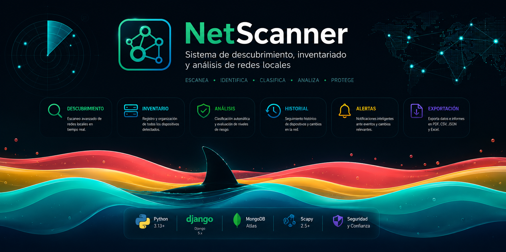
</p>

<h1 align="center">NetScanner</h1>

<p align="center">
  Sistema de descubrimiento, inventariado y análisis de redes locales
</p>

<p align="center">
  <strong>Django</strong> • <strong>MongoDB Atlas</strong> • <strong>Scapy</strong> • <strong>Python 3.13</strong>
</p>

---

# Descripción

NetScanner es una aplicación web desarrollada para el descubrimiento, clasificación e inventariado de dispositivos conectados a una red local.

La plataforma permite ejecutar escaneos de red, identificar dispositivos activos, registrar información histórica, calcular niveles de riesgo y confianza, visualizar una topología activa de la red y generar exportaciones en distintos formatos.

El proyecto combina capacidades de monitorización, documentación e inventariado dentro de una única interfaz web moderna basada en Django y MongoDB.

---

# Características principales

| Funcionalidad | Estado |
|--------------|---------|
| Descubrimiento de dispositivos | ✅ |
| Inventario de activos | ✅ |
| Topología Activa | ✅ |
| Historial de Red | ✅ |
| Sistema de confianza | ✅ |
| Sistema de riesgo | ✅ |
| Alertas de seguridad | ✅ |
| Consulta personalizada | ✅ |
| Exportación PDF | ✅ |
| Exportación CSV | ✅ |
| Exportación JSON | ✅ |
| Exportación Excel | ✅ |
| Tema claro / oscuro | ✅ |

---

# Tecnologías utilizadas

### Backend

- Python 3.13
- Django
- PyMongo
- MongoDB Atlas
- Scapy

### Frontend

- HTML5
- CSS3
- Tailwind CSS
- JavaScript

### Exportación

- Pandas
- OpenPyXL
- XlsxWriter
- ReportLab
- xhtml2pdf

### Dependencias de red

- Npcap

---

# Capturas de pantalla

## Inicio de sesión

La aplicación utiliza autenticación mediante credenciales de MongoDB Atlas.

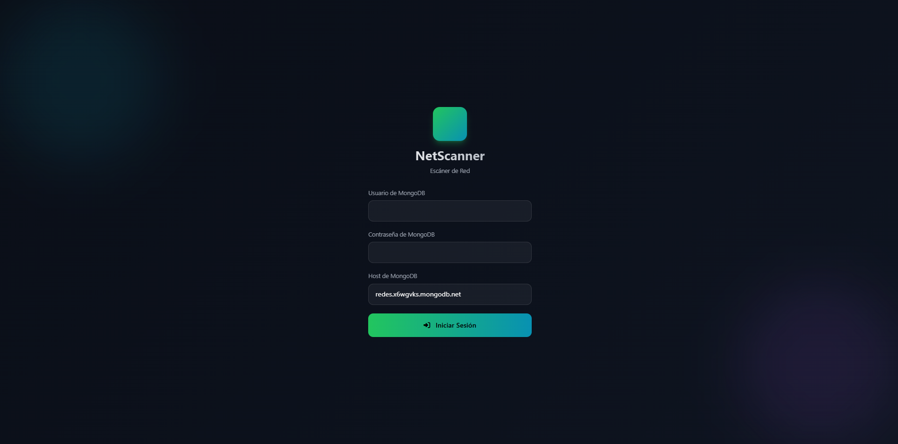

---

## Topología Activa

Pantalla principal del sistema. Muestra únicamente los dispositivos detectados durante el último escaneo.

**Incluye:**

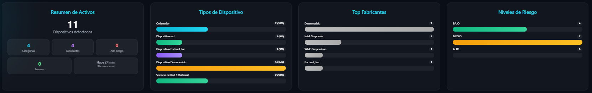

- Resumen de activos
- Fabricantes
- Tipos de dispositivo
- Riesgos
- Nivel de confianza
- Topología agrupada por categorías

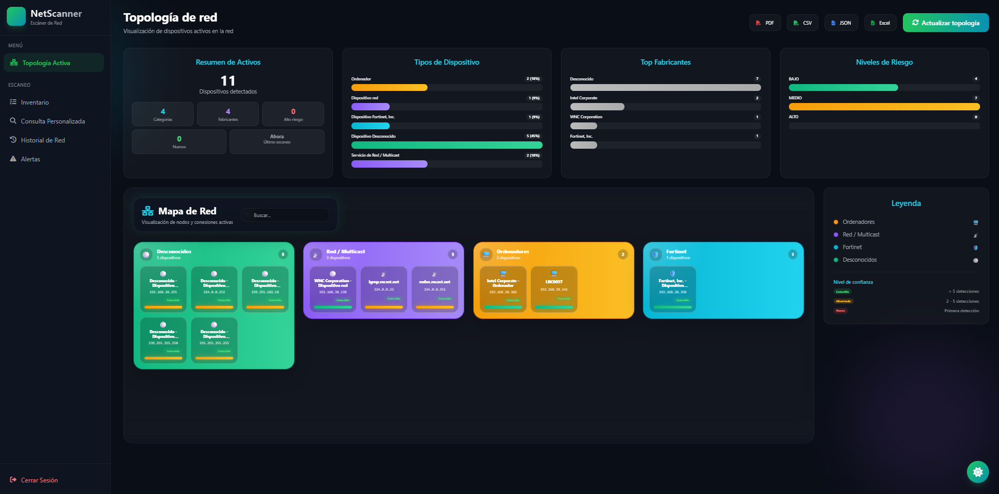

**Tooltip:**
- Muestra información detallada sobre cada dispositivo.
- Permite identificar fácilmente los dispositivos activos, inactivos, con riesgo y sin riesgo.

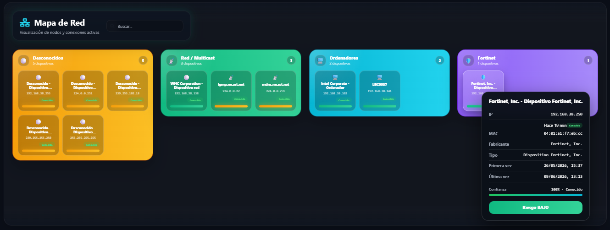

---

## Escaneo de red en ejecución

Durante el escaneo se muestra una animación personalizada basada en olas y un tiburón, utilizada como indicador visual del progreso del análisis.

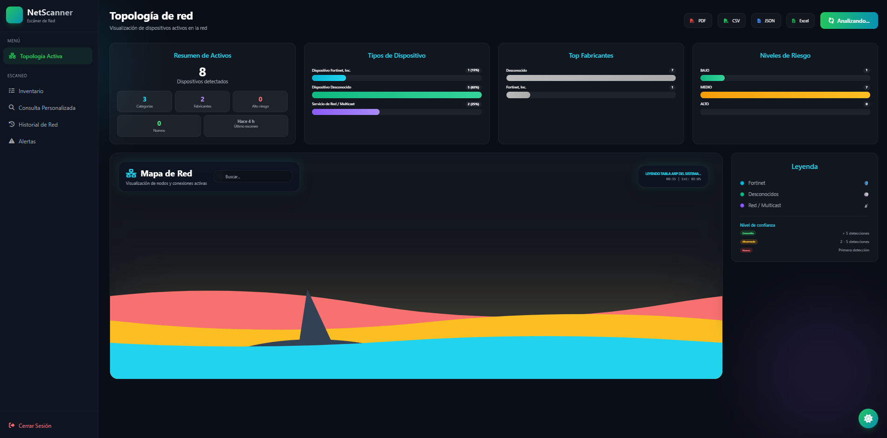

---

## Historial de Red

Vista histórica de dispositivos detectados.

Incluye:

- Registros acumulados
- Estadísticas
- Riesgos
- Fechas de detección
- Historial de actividad

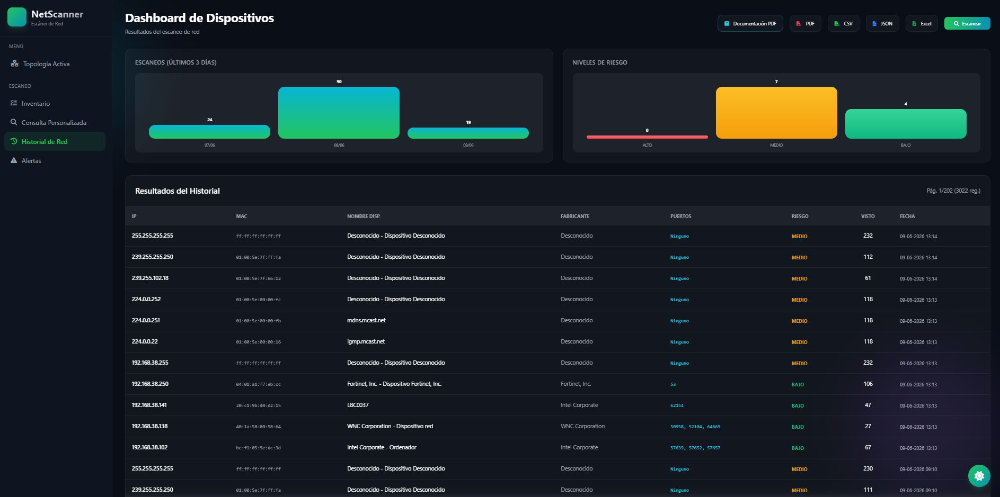

---

## Inventario de Dispositivos

Permite gestionar nombres personalizados asociados a cada dirección MAC.

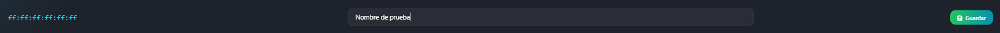

Los nombres definidos por el usuario se reflejan automáticamente en la Topología Activa y en el Historial de Red.

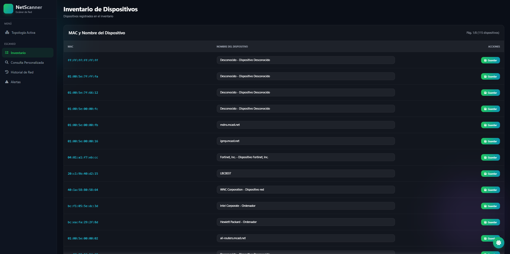

---

## Consulta Personalizada

Constructor dinámico de consultas.

**Permite:**

- Seleccionar campos
- Filtrar información
- Ordenar resultados
- Limitar registros
- Consultar historial, inventario y logs

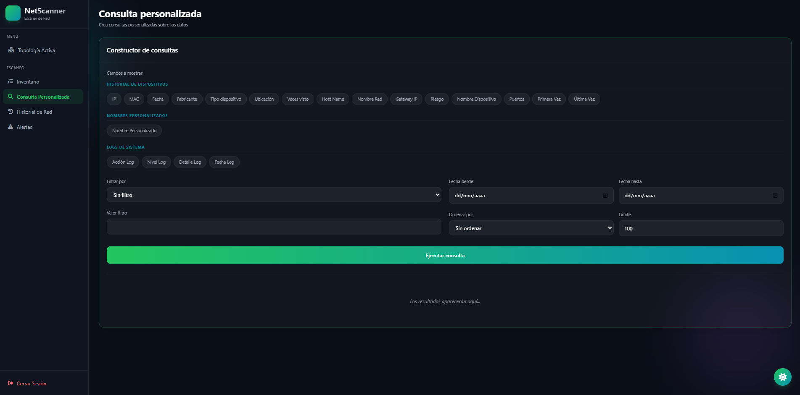

**Resultado:**

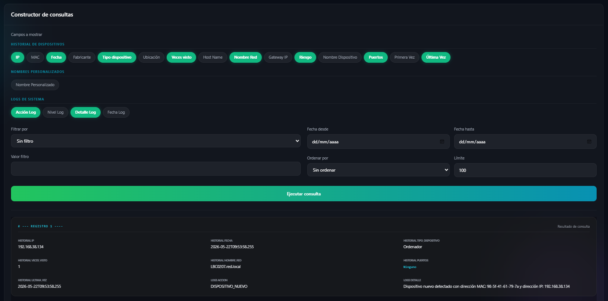

---

## Exportaciones

Permite exportar datos en distintos formatos.

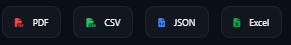

**Permite:**

- Exportar desde Topología Activa
- Exportar desde Historial de Red
- Exportar desde Inventario
- Exportar desde Logs
---

## Sistema de Alertas

Registro histórico de eventos relevantes detectados por el sistema.

Ejemplos:

- Dispositivos nuevos
- Cambios de IP
- Fabricantes desconocidos
- Eventos relevantes de seguridad

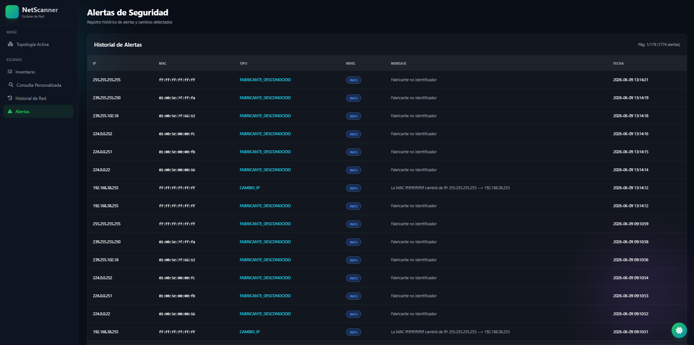

---

# Arquitectura

```text
Frontend
│
├── Templates Django
├── CSS / Tailwind
└── JavaScript

Views
│
├── Renderizado HTML
└── Endpoints JSON

Services
│
├── Escaneo
├── Clasificación
├── Riesgo
├── Consultas
└── Exportación

Repositories
│
├── Activos
├── Historial
├── Inventario
├── Logs
└── Alertas

MongoDB Atlas
```

---

# Estructura del proyecto

```text
Escanear-de-red/
│
├── app_django/
├── panel/
├── services/
├── repositories/
├── managers/
├── models/
├── config/
│
├── imgs/
│   ├── banner_net_scanner.png
│   ├── inicio_sesion.png
│   ├── topologia_terminada.png
│   ├── topologia_en_proceso.png
│   ├── historial_red.png
│   ├── inventario_nombres_dispositivos.png
│   ├── query_personalizada.png
│   └── alertas.png
│
├── README.md
├── requirements.txt
└── manage.py
```

---

# Instalación

## 1. Clonar repositorio

```bash
git clone <url-del-repositorio>
cd Escanear-de-red
```

## 2. Crear entorno virtual

```powershell
py -3.13 -m venv venv
```

## 3. Activar entorno virtual

```powershell
.\venv\Scripts\Activate.ps1
```

## 4. Instalar dependencias

```powershell
pip install -r requirements.txt
```

## 5. Aplicar migraciones

```powershell
python manage.py migrate
```

## 6. Ejecutar aplicación

```powershell
python manage.py runserver
```

---

# Acceso

Una vez iniciada la aplicación:

```text
http://127.0.0.1:8000/
```

---

# Documentación

La documentación completa del proyecto se encuentra en:

- `MANUAL_USUARIO.md`
- `MEMORIA_TECNICA.md`

Incluyen:

- Guía de instalación
- Configuración
- Manual de uso
- Arquitectura interna
- Base de datos
- Servicios
- Clasificación de dispositivos
- Sistema de riesgo
- Sistema de confianza

---

## Autores

<p align="center">

<a href="https://github.com/alejandroDonGar">Alejandro Donate</a> •
<a href="https://github.com/MesaNoche">Alejandro García</a> •
<a href="https://github.com/diego-febles-seoane">Diego Febles</a> •
<a href="https://github.com/Diego-70tech">Diego Rodríguez</a> •
<a href="https://github.com/IbrahimAlvarez30">Ibrahim Álvarez</a> •
<a href="https://github.com/lopezmontanoanthony-ux">Anthony López</a> •

</p>

---

## Licencia

Proyecto desarrollado con fines educativos y de aprendizaje.